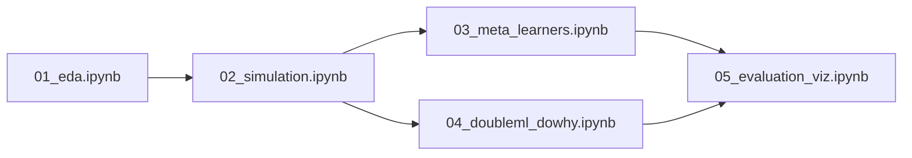

# Uplift Modeling for Retention Interventions on MovieLens

Estimate **heterogeneous treatment effects (HTE)** of a simulated OTT platform notification on user return-to-platform behavior, using meta-learners (S/T/X) from `causalml` and a Double ML estimator from `dowhy`, evaluated via AUUC.

---

## Stack & Key Dependencies

| Layer | Library |
|---|---|
| Data | `MovieLens 1M` (via `surprise` or direct download) |
| Feature Engineering | `pandas`, `numpy`, `scikit-learn` |
| Meta-learners | `causalml` (S/T/X/R-learners + uplift trees) |
| DML / Robustness | `dowhy` (EconML backend + refutation API) |
| Evaluation | Custom AUUC, Qini curve |
| Viz | `matplotlib`, `seaborn`, `shap` |
| Notebooks | `jupyter` |

---

## Project Structure

```
uplift-retention/
├── data/
│   └── ml-1m/                    # Raw MovieLens 1M files
├── notebooks/
│   ├── 01_eda.ipynb
│   ├── 02_simulation.ipynb
│   ├── 03_meta_learners.ipynb
│   ├── 04_doubleml_dowhy.ipynb
│   └── 05_evaluation_viz.ipynb
├── src/
│   ├── data_loader.py
│   ├── feature_engineering.py
│   ├── simulate_rct.py
│   ├── meta_learners.py
│   ├── doubleml_estimator.py
│   ├── evaluation.py
│   └── viz.py
├── results/
│   └── figures/
├── requirements.txt
└── README.md
```

---

## Phase 1 — Data & Feature Engineering

**Goal**: Convert implicit MovieLens interaction log into a user-level feature table.

### [`data_loader.py`](file:///d:/projects/101/uplift-retention/src/data_loader.py) [NEW]
- Download/parse `ml-1m` ratings, users, movies files
- Merge into a single DataFrame

### [`feature_engineering.py`](file:///d:/projects/101/uplift-retention/src/feature_engineering.py) [NEW]
Build **per-user covariates** `X` (confounders + moderators):

| Feature | Source |
|---|---|
| `activity_level` | rating count in first 30 days |
| `genre_entropy` | diversity of rated genres |
| `avg_rating` | mean score given |
| `recency` | days since last rating (at split point) |
| `age`, `gender`, `occupation` | user metadata |
| `preferred_genre_*` | one-hot top genre |

### [`simulate_rct.py`](file:///d:/projects/101/uplift-retention/src/simulate_rct.py) [NEW]

**Treatment simulation** — two options (implement both, flag-selectable):

1. **Observational (confounded)**: Treatment probability `P(T=1|X)` is a learned propensity (sigmoid of activity + recency), so high-activity users are more likely to be "nudged." Introduces selection bias intentionally, to stress-test estimators.
2. **RCT**: Bernoulli(0.5) assignment, as a sanity-check baseline.

**Outcome simulation**: Binary `Y` (returned to platform within 7 days after split):
```
Y = sigmoid(β·X + τ(X)·T + ε)
```
where `τ(X)` = **heterogeneous CATE** — positive for low-recency users, near-zero for already-active users. This ground-truth CATE is used to benchmark estimators.

> [!IMPORTANT]
> Keeping ground-truth CATE in the simulation is what enables honest AUUC evaluation and comparison vs. naive ATE.

---

## Phase 2 — Meta-Learners via `causalml`

### [`meta_learners.py`](file:///d:/projects/101/uplift-retention/src/meta_learners.py) [NEW]

Run all four estimators from `causalml`, each backed by `LightGBM`:

```python
from causalml.inference.meta import (
    LRSRegressor,   # S-learner
    BaseTRegressor, # T-learner
    BaseXRegressor, # X-learner
    BaseRRegressor, # R-learner
)
```

**Outputs per model**:
- Per-user CATE estimates `τ̂(Xᵢ)`
- Bootstrap confidence intervals (causalml built-in)
- Feature importance via SHAP

**Uplift tree** (causalml):
```python
from causalml.inference.tree import UpliftTreeClassifier
```
— For interpretability: shows which user segments respond most to treatment.

---

## Phase 3 — Double ML via `dowhy`

### [`doubleml_estimator.py`](file:///d:/projects/101/uplift-retention/src/doubleml_estimator.py) [NEW]

Use `dowhy`'s EconML integration for **DoubleML / Partially Linear Regression**:

```python
from dowhy import CausalModel
# EconML DML estimator as the backend
from econml.dml import CausalForestDML
```

**Refutation suite** (key differentiator — shows robustness):

| Refutation Test | What it checks |
|---|---|
| `placebo_treatment_refuter` | Replace T with random noise → CATE should collapse to 0 |
| `random_common_cause` | Add random confounder → estimate should be stable |
| `data_subset_refuter` | Bootstrap stability of the estimate |
| `add_unobserved_common_cause` | Sensitivity to unobserved confounding (E-value analog) |

> [!NOTE]
> The refutation API output is a p-value and effect-shift. Report these in the paper/README as the robustness section — this is exactly the "sensitivity to unobserved confounding" point from the JD.

---

## Phase 4 — Evaluation

### [`evaluation.py`](file:///d:/projects/101/uplift-retention/src/evaluation.py) [NEW]

**AUUC (Area Under Uplift Curve)** — the primary metric:
```
Sort users by τ̂ descending → compute cumulative uplift at each decile → integrate
```

Additional metrics:
- **Qini coefficient** (normalized AUUC variant)
- **PEHE** (Precision in Estimation of HTE) — uses ground-truth `τ(X)` from simulation
- **Calibration plot**: mean predicted CATE vs. empirical lift by decile

| Model | AUUC | Qini | PEHE |
|---|---|---|---|
| S-learner | | | |
| T-learner | | | |
| X-learner | | | |
| R-learner | | | |
| DoubleML (CausalForest) | | | |
| Naive ATE baseline | — | — | — |

---

## Phase 5 — Visualization & Notebook Polish

### [`viz.py`](file:///d:/projects/101/uplift-retention/src/viz.py) [NEW]
- Uplift curves (all models overlaid)
- Qini curves
- CATE distribution by user segment (violin plot)
- SHAP beeswarm for X-learner
- Uplift tree diagram (`causalml` built-in plot)
- Refutation test result table

---

## Execution Order



---

## Open Questions

> [!IMPORTANT]
> **Simulation realism**: Should the heterogeneity in `τ(X)` be purely synthetic (full control over ground truth) or partially estimated from MovieLens engagement patterns (more realistic but no true CATE oracle)? Recommend: synthetic τ(X) for benchmarking + note the limitation.

> [!NOTE]
> **Scale**: MovieLens 1M (~6k users, 1M ratings) is enough for fast iteration. MovieLens 25M is available if you want larger-scale claims.

> [!NOTE]
> **LightGBM vs. Random Forest backends**: `causalml` supports both. LightGBM is faster and often better; RF is more interpretable. Worth running both for the T-learner at minimum.

---

## Verification Plan

### Automated
- `pytest` unit tests for AUUC computation (known-case assertions)
- Simulation sanity check: naive ATE under RCT should recover `E[τ(X)]`

### Manual
- Placebo test: under `T := random`, all meta-learners' AUUC should converge to 0.5
- CATE sign check: low-recency users should have positive τ̂ by construction
- Refutation p-values: placebo refuter p-value should be < 0.05 (i.e., model responds correctly to the true signal)

---

## Estimated Timeline

| Phase | Effort |
|---|---|
| Phase 1: Data + Simulation | ~1 day |
| Phase 2: Meta-learners | ~1 day |
| Phase 3: DoubleML + Refutation | ~1 day |
| Phase 4–5: Eval + Viz + Notebooks | ~1 day |
| README + write-up polish | ~0.5 day |
| **Total** | **~4.5 days** |
